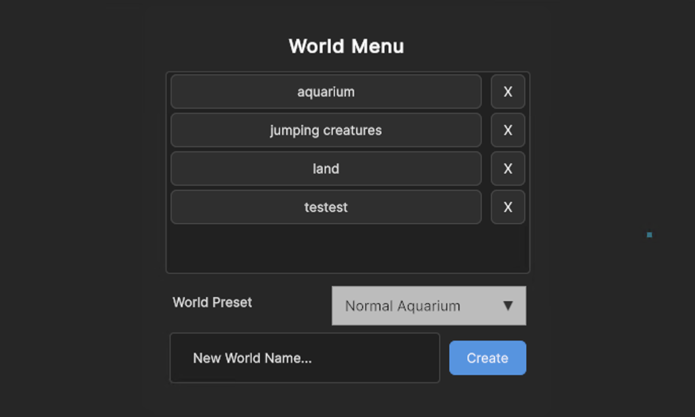

# Neural Network Creature Simulation

A Unity-based simulation where AI creatures learn to navigate terrains and find food using neural networks and genetic algorithms. 

## Key Features
- **Neural Network Brains**: Each creature processes sensory inputs (wall detection, food detection, predator awareness) to make movement decisions
- **Genetic Evolution**: Population evolves over generations using selection, crossover, and mutation
- **Persistence**: Save and load the best-performing neural networks, and the constructed world to continue training across sessions

## Demo

<table>
  <tr>
    <td align="center"><strong>World Selection & Management</strong></td>
    <td align="center"><strong>Neural Network Visualization</strong></td>
  </tr>
  <tr>
    <td></td>
    <td></td>
  </tr>
</table>

## Challenges & Key Learnings
A big challenge was debugging why creatures weren't learning properly. Usually it came down to passing in wrong inputs or not configuring Unity components correctly, which would mess up their sensory data. The fitness function also caused some weird behaviors until I got it right.

Another major issue I ran into was performance problems that made everything laggy. The hard part was finding what exactly caused it. By isolating/removing components one by one, I found out it was due to a logic in the load from file function that wasn't properly clearing world objects, so old worlds would leave behind empty objects that accumulated over time. Kinda cool how well some basic debugging concepts work.

In terms of implementation difficulty, it was also definitely the save/load system for both worlds and neural networks.